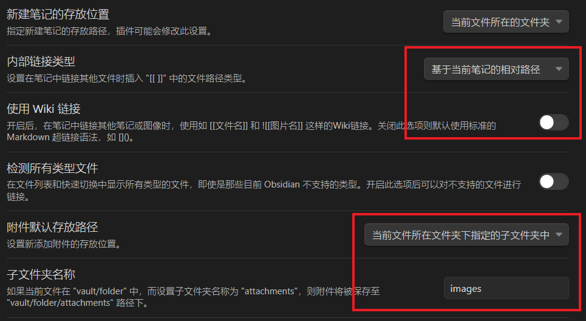

# Obsidian使用

## 1. Windows

### 1.1. Obsidian安装

Windows Obsidian下载 [Download - Obsidian](https://obsidian.md/download)    

### 1.2. Obsidian配置

#### 1.2.1. md文件大纲自动编号
使用 Number headings 插件， 获取 Number headings 插件有两种方式：
- 直接从 Obsidian 安装最新 Number headings 插件，转到 设置 -> 社区插件 -> 浏览-> 检索Number headings。
- 将最新 Number headings 安装包解压缩到您的 <font color='red'>vault</font>/.obsidian/plugins/ 文件夹中。 [Download - Number headings](https://github.com/onlyafly/number-headings-obsidian/releases/latest)

#### 1.2.2. md文件图片配置
1. 图片位置
设置 -> 文件与链接，做如下配置：


1. 图片居中
在<font color='red'>vault</font>/.obsidian/snippets/ 文件夹中放置新的CSS样式文件。
image_center.css 代码如下：
```
img {
    display: block !important;
    margin-left: auto !important;
    margin-right: auto !important;
}

table
{
  width: auto;
  display: table;
  margin-left: auto;
  margin-right: auto;
}
   
 .markdown-source-view.mod-cm6 .cm-content > * {
    margin: auto auto !important;
}
```

设置 -> 外观 -> CSS代码片段，刷新后出现新写的image_center，打开配置即可。


#### 1.2.3. md文件文字标红、居中特殊处理
1、下载安装 AutoHotkey 自动化工具
[AutoHotkey](https://www.autohotkey.com/)

2、编写自动化脚本，Alt + 1：选中文字标红；Alt + 2：选中文字居中；
MyObsidianHotkeyScript .ahk 
```
; Obsidian
; 快捷增加字体颜色
; SendInput {Text} 解决中文输入法问题
 
#IfWinActive ahk_exe Obsidian.exe
{
     
    ; alt+0 黑色
    !0::addFontColor("black")
  
    ; alt+1 红色
    !1::addFontColor("red")

    ; alt+2  居中
    !2::addCenter()

}
 
 addFontColor(color){
    Send {ctrl down}c{ctrl up} ; 复制
    SendInput {TEXT}<font color='%color%'>
    SendInput {ctrl down}v{ctrl up} ; 粘贴
    SendInput {TEXT}</font> ; 
}

 addCenter(){
    Send {ctrl down}c{ctrl up} ; 复制
    SendInput {TEXT}<center>
    SendInput {ctrl down}v{ctrl up} ; 粘贴
    SendInput {TEXT}</center> ;
}
```
### 1.3. Obsidian同步
#### 1.3.1. GitHub同步